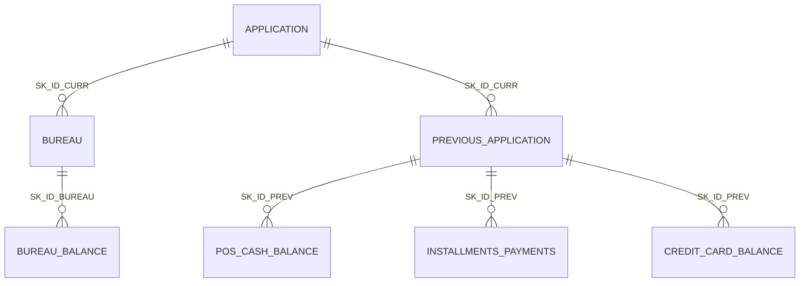

# Les données : des 7 tables sources aux tables de production

Ce document suit les données de bout en bout : les tables Home Credit dont le modèle a
appris, la façon dont elles deviennent 779 features, ce que l'API accepte de recevoir,
et ce que la production enregistre. Chaque choix est justifié ; les chiffres viennent des
fichiers eux-mêmes (comptés sur le poste) et de `output/feature_dataset.parquet` de la
Partie 1.

## 1. Les sept tables sources

Jeu Kaggle [Home Credit Default Risk](https://www.kaggle.com/competitions/home-credit-default-risk),
2,6 Go de CSV, non versionnés (voir [`data/README.md`](../data/README.md)). Une ligne de
`application` = une demande de crédit = un client (`SK_ID_CURR`). Les six autres tables
décrivent le **passé** de ce client, chez Home Credit ou chez d'autres prêteurs.

| Table | Grain (une ligne =) | Clé | Lignes | Colonnes | Ce qu'elle apporte |
|---|---|---|---:|---:|---|
| `application_train` | une demande, avec `TARGET` | `SK_ID_CURR` | 307 511 | 122 | le dossier : revenus, montants, âge, emploi, logement, famille, documents, 3 scores externes |
| `application_test` | une demande, sans `TARGET` | `SK_ID_CURR` | 48 744 | 121 | même dossier, jeu de soumission Kaggle ; sert ici de trafic simulé |
| `bureau` | un crédit déclaré au bureau de crédit | `SK_ID_BUREAU` → `SK_ID_CURR` | 1 716 428 | 17 | crédits chez d'autres prêteurs : montants, statut, retards |
| `bureau_balance` | un mois d'un crédit bureau | `SK_ID_BUREAU` | 27 299 925 | 3 | statut mensuel (à jour, en retard de 1 à 5 tranches, clos) |
| `previous_application` | une demande précédente chez Home Credit | `SK_ID_PREV` → `SK_ID_CURR` | 1 670 214 | 37 | demandes passées : approuvée, refusée, annulée, montants, conditions |
| `POS_CASH_balance` | un mois d'un crédit de consommation ou de trésorerie | `SK_ID_PREV`, `SK_ID_CURR` | 10 001 358 | 8 | échéances restantes, jours de retard mois par mois |
| `installments_payments` | une échéance et son paiement réel | `SK_ID_PREV`, `SK_ID_CURR` | 13 605 401 | 8 | ce qui était dû, ce qui a été payé, et quand |
| `credit_card_balance` | un mois d'une carte de crédit | `SK_ID_PREV`, `SK_ID_CURR` | 3 840 312 | 23 | solde, tirages, retards sur les cartes |

Trois choses à savoir sur ce schéma :

- **Tout est relatif à la date de la demande.** Les colonnes `DAYS_*` comptent en jours
  *avant* la demande, donc sont négatives ou nulles (`DAYS_BIRTH = −12 000` : 33 ans) ;
  les `MONTHS_BALANCE` comptent en mois avant. C'est pour cela que l'API accepte des jours
  négatifs et refuserait un âge positif : une règle « âge > 0 » rejetterait tout le monde.
- **La cible** `TARGET` vaut 1 quand le client a eu des difficultés de paiement (retard de
  plus de X jours sur au moins une des Y premières échéances) : **8,07 %** des 307 507
  clients étiquetés. C'est ce déséquilibre qui rend l'accuracy inutilisable comme métrique
  (voir [`modele-partie1.md`](modele-partie1.md)).
- **Tous les clients n'ont pas d'historique.** Sur le jeu d'entraînement, 85,7 % ont au
  moins un crédit au bureau, 94,6 % une demande précédente chez Home Credit, 28,3 % une
  carte de crédit. Pour les autres, les agrégats correspondants n'existent pas : ils sont
  **manquants, pas nuls**, et le modèle a appris avec ces manques.

## 2. Des tables aux 779 features

Le pipeline `src/prepare_data.py` (adapté du kernel Kaggle *jsaguiar*, hérité de la
Partie 1) ramène tout au grain **un client = une ligne**, par agrégation sur
`SK_ID_CURR`, puis jointures **à gauche** sur `application`. Résultat :
`output/feature_dataset.parquet`, 356 251 lignes (train + test), 779 features.

| Famille (préfixe) | Features | Source | Comment elles sont construites |
|---|---:|---|---|
| dossier de demande (sans préfixe) | **245** | `application` | 104 colonnes numériques brutes, 3 binaires codées 0/1 (genre, voiture, logement), 133 indicatrices *one-hot* de 13 catégorielles (type de contrat, profession, organisation, logement…), 5 ratios métier |
| `BURO_`, `ACTIVE_`, `CLOSED_` | 62 + 27 + 27 | `bureau` (+ `bureau_balance`) | min / max / moyenne / variance / somme des montants et des dates ; part de chaque statut ; recalculés sur les seuls crédits **actifs** puis **clos** |
| `PREV_`, `APPROVED_`, `REFUSED_` | 189 + 30 + 30 | `previous_application` | mêmes agrégats ; recalculés sur les demandes **approuvées** puis **refusées** |
| `POS_` | 18 | `POS_CASH_balance` | retards max et moyens, nombre de mois suivis |
| `INSTAL_` | 26 | `installments_payments` | retards et avances de paiement (`DPD`, `DBD`), part payée, écart payé / dû |
| `CC_` | 125 | `credit_card_balance` | min / max / moyenne / somme / variance de toutes les colonnes |
| **total** | **779** | | **245 « dossier » + 534 « historique »** |

Les règles du pipeline, et pourquoi elles sont défendables :

1. **Agrégations par statistiques simples** (min, max, moyenne, somme, variance,
   effectif) plutôt que par séquences : le modèle voit « ce client a eu au plus 30 jours de
   retard, en moyenne 2 » sans dépendre de la longueur de l'historique. Un client sans
   ligne dans une table n'a *aucune* de ces features : `NaN`.
2. **Catégorielles encodées en one-hot, puis moyennées** : sur une table d'historique, la
   moyenne d'une indicatrice est une **part** (« 40 % de ses demandes passées ont été
   refusées »), lisible par le métier. Le one-hot de 13 catégorielles du dossier
   (133 indicatrices) explique pourquoi le dossier pèse 245 features pour 120 colonnes
   de départ.
3. **Sous-populations** : les agrégats sont recalculés sur les crédits actifs / clos et
   sur les demandes approuvées / refusées, parce que le *sens* d'un historique compte
   autant que son volume.
4. **Une valeur sentinelle neutralisée** : `DAYS_EMPLOYED = 365 243` (mille ans) code
   « sans emploi ou retraité » dans la source ; laissée telle quelle, elle ferait de ces
   clients les plus anciens salariés du monde. Elle devient `NaN` (18,0 % des clients),
   comme les dates sentinelles de `previous_application`.
5. **Cinq ratios métier** ajoutés au dossier : `PAYMENT_RATE` (annuité / crédit, c'est-à-
   dire la vitesse de remboursement, l'une des features les plus importantes du modèle),
   `ANNUITY_INCOME_PERC`, `INCOME_CREDIT_PERC`, `INCOME_PER_PERSON`, `DAYS_EMPLOYED_PERC`.
   Un ratio peut valoir ±∞ (dénominateur nul) : il est ramené à `NaN` à l'entraînement, et
   l'API refuse `Infinity` en entrée.
6. **Aucune imputation.** LightGBM apprend pour chaque coupure de quel côté envoyer les
   valeurs manquantes ; imputer par une moyenne inventerait une information et effacerait
   le signal « ce client n'a pas d'historique ». C'est aussi ce qui rend le contrat de
   l'API possible : envoyer ce dont on dispose, le reste est manquant, comme à
   l'entraînement.
7. **Quatre lignes écartées** : `CODE_GENDER = XNA` (4 clients sur 307 511), une modalité
   sans effectif exploitable. D'où 307 507 clients étiquetés partout dans ce dépôt.

Les trois `EXT_SOURCE_*` méritent une mention : ce sont des **scores externes normalisés
entre 0 et 1**, fournis par des organismes tiers, et les features les plus discriminantes
du modèle. `EXT_SOURCE_1` manque pour 56,4 % des clients, `EXT_SOURCE_3` pour 19,8 %,
`EXT_SOURCE_2` pour 0,2 %. Un appelant qui cesserait de les transmettre changerait
mécaniquement les scores : c'est pour cela que le tableau de bord surveille la
**couverture** des dossiers avant d'accuser le modèle.

## 3. Ce que l'API reçoit

Le modèle attend un vecteur de 779 features, pas un dossier brut. Le contrat retenu
(détail des alternatives dans [`choix-techniques.md`](choix-techniques.md#2-un-dictionnaire-libre-de-features-plutôt-quun-identifiant-client))
est un **dictionnaire libre `{nom de feature: valeur}`** :

| | Features « dossier » (245) | Features « historique » (534) |
|---|---|---|
| Qui les connaît | l'appelant, au moment de la demande | le système d'information du prêteur, s'il a déjà vu le client |
| Obligatoires ? | au moins **50 %** doivent être renseignées (`MIN_APPLICATION_COVERAGE`), sinon 422 « dossier trop incomplet » | non : légitimement absentes pour un primo-emprunteur |
| Si absentes | `NaN` | `NaN`, comme à l'entraînement |
| Contrôles | noms connus, pas de `NaN`/`Infinity`, bornes mesurées sur les 307 507 clients (`EXT_SOURCE_` dans [0, 1], `DAYS_` ≤ 0, `AMT_` et `CNT_` ≥ 0, `FLAG_` dans {0, 1}) | les mêmes |

Le seuil de 50 % vient des données : sur le jeu d'entraînement, la couverture moyenne du
dossier est de 88,7 % et le premier centile de 78,4 %. Un dossier rempli à moins de la
moitié n'existe pas dans ce que le modèle a vu ; le scorer serait rendre un chiffre sans
fondement. La réponse renvoie la couverture (`features_provided`, `application_ratio`,
`history_ratio`) pour que l'appelant sache sur quelle information le score repose.

**Pourquoi ne pas envoyer les données brutes du client ?** Parce que l'agrégation des
sept tables est un traitement lourd (2,6 Go, plusieurs minutes) qui appartient au système
qui détient l'historique, pas à un service de scoring qui doit répondre en quelques
millisecondes. Et parce que recevoir des lignes brutes obligerait l'API à embarquer tout
le pipeline et à en garantir l'identité avec l'entraînement : ce serait déplacer le
problème sans le résoudre.

## 4. Ce que la production enregistre

Deux tables PostgreSQL, alimentées par l'API après chaque réponse (détail et
justifications dans [`monitoring.md`](monitoring.md)) :

| Table | Grain | Colonnes clés | Sert à |
|---|---|---|---|
| `requests` | un appel HTTP, erreurs comprises | `request_id`, `occurred_at`, `path`, `status_code`, `duration_ms` | taux d'erreur, latence perçue |
| `predictions` | un dossier scoré | `request_id`, `occurred_at`, `model_version`, `threshold`, `probability`, `decision`, couverture (4 colonnes), `latency_ms`, `features` en **JSONB** | taux de refus, dérive (PSI), retrouver une décision contestée |

Le choix structurant est le `JSONB` pour les features : 779 colonnes seraient ingérables
et cassées au premier changement de contrat, alors qu'une clé JSON reste requêtable
(`features->>'EXT_SOURCE_2'`) et absorbe une nouvelle version du modèle. Les features
ne partent **que** dans cette base, jamais sur la sortie standard : les journaux
applicatifs finissent souvent chez un tiers, pas les revenus d'un demandeur.

## 5. La référence de dérive

Comparer la production à « avant » exige une référence : ce sont **20 000 clients
étiquetés du jeu d'entraînement** (graine 42), les mêmes pour le notebook
`07_data_drift.ipynb` et pour le tableau de bord. Pas le jeu de test Kaggle : la
référence doit être ce sur quoi le modèle a appris, sa définition du « normal ». Le
tableau de bord n'en garde que les déciles et les proportions des 20 features au plus
fort gain (`monitoring/profil_reference.json`) : aucune ligne client n'est versionnée.

## 6. Ce qui ne quitte jamais le poste

- Les CSV Kaggle, le parquet et le registre MLflow de la Partie 1 : exclus par
  `.gitignore`, reproductibles à partir du code.
- Les 25 « vrais clients » des tests de fidélité : lus à l'exécution depuis le parquet
  (`P6_PROJECT_ROOT`), jamais copiés dans `tests/`. Sans les données, ces tests sont
  ignorés, pas contournés.
- Les exemples de Swagger (`api/exemple_dossier_*.json`) : deux dossiers construits pour
  la démonstration, pas des clients réels.
- L'artefact du modèle (5,4 Mo) est versionné : il ne contient que des seuils d'arbres,
  aucune donnée individuelle.
